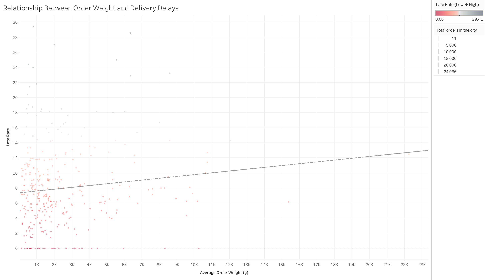
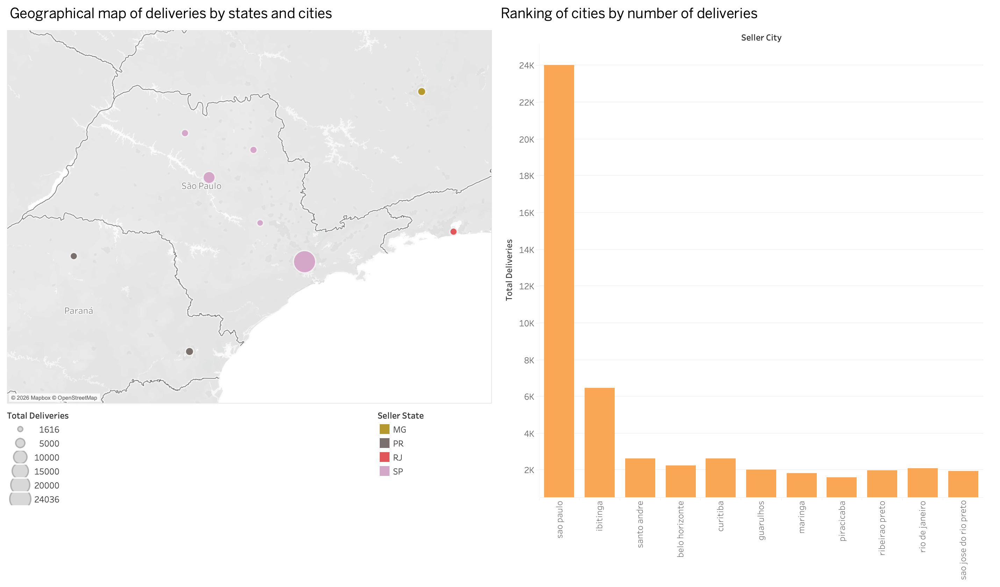

# Logistics and Customer Satisfaction Analysis Brazilian E-Commerce 
## About the project
This analysis identifies critical factors that affect delivery quality and customer experience
I used this dataset to demonstrate the full data lifecycle:
from ETL processes to building business hypotheses
### Main goal:
Find out why orders are late and how this translates into reputational damage for the marketplace
## Stack
* **SQL (PostgreSQL):** Complex queries, window functions, CTE for calculating Delay Rate
* **Python:** Preprocessing data, removing duplicates, and converting types
* **Tableau:** Correlation analysis and visualization of insights
* **SQLAlchemy:** Integrating Python with the database to automate updates
## Process
### 1. Data preparation and transformation
At the initial stage, using **Python** and **SQLAlchemy**, the following was performed:
* Conversion of text date fields to `TIMESTAMP` format for correct calculations
* Cleaning duplicates and validating data
* Loading cleaned data into PostgreSQL
### 2. Key SQL metrics
To analyze logistics, queries were developed to calculate:
* **Delay Rate:** Percentage of orders delivered later than the promised delivery date
* **Average Review Score:** Comparison of ratings for on-time and late deliveries
* **Weighted Delivery Analysis:** The impact of product weight on the likelihood of delay
## Results
### 1. Impact of delays on customer experience
The analysis showed a high correlation between on-time delivery and user ratings:
* **On-time delivery:** Average rating — **4.29** 
* **Delays:** Average rating drops to **2.57**
* **Conclusion:** Late delivery is the main driver of negative reviews

### 2. Correlation between product weight and logistics speed
I discovered a certain correlation:
* The higher the average weight of goods in the seller's city, the higher the **Delay Rate**
* Goods weighing more than **10 kg** have a 2-3 times higher risk of delay compared to light parcels
* The P-value of this data is **0.03**, which indicates its significance

### 3. Geographical anomalies
The cities with the highest levels of delays were identified. For example, the city of **Sombrio** shows a high level of delays, which directly correlates with the high average weight of goods in this region **22 kg**

**Graphic** [http://bit.ly/4006DGY]s

## Recommendations
1. **Dynamic delivery times:** Implement an algorithm that automatically adds +1-2 days to the expected delivery date for goods weighing more than **10 kg**
2. **Optimize partnerships:** Review logistics partners in cities with a Delay_Rate > 15% to identify the causes of delays
3. **Manage expectations:** Warn customers about possible delays for large items at the checkout stage

---
## Contacts
* **LinkedIn:** [www.linkedin.com/in/yurii-borysonok]
* **City:** Lviv, Ukraine
